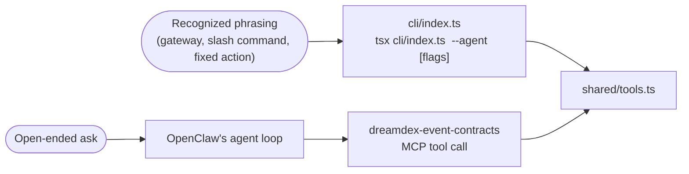

# OpenClaw — Agent Skills

Two [Agent Skills](https://agentskills.io) (the open `SKILL.md` format) that teach
[OpenClaw](https://openclaw.ai/)'s own agent loop how to act on the **Agentic Prediction Market
(APM)** — a Polymarket-style venue built on DreamDEX Event Contracts (Somnia). Neither skill talks
to the app directly: both drive the same `dreamdex-event-contracts` MCP tool server this repo
already ships (`proxy-servers/shared/mcpServer.ts`), the exact tools the built-in Sage/Ada/Nomi
agents use internally — see [proxy-servers/README.md](../../proxy-servers/README.md).

## How it fits together

```mermaid
flowchart LR
    subgraph OpenClaw["OpenClaw"]
        direction TB
        Skills["Agent Skills\n~/.agents/skills/\nbettor-agent · creator-agent"]
        Core["OpenClaw's agent loop"]
        MCPClient["MCP client\nmcp.servers: dreamdex-event-contracts"]
        Skills -- "loaded when a task\nmatches its description" --> Core
        Core -- "picks a tool" --> MCPClient
    end

    MCPClient -- "spawns (stdio)" --> Server["dreamdex-event-contracts\nproxy-servers/shared/mcpServer.ts\n11 market-action tools"]
    Server -- "HTTP REST\nAPM_API_URL" --> API["app API\n:3000"]
    API --> Engine["MockEngine / LiveEngine\npackages/market-engine"]
    Engine -. "MARKET_ENGINE=live" .-> Somnia["DreamDEX Event Contracts\non Somnia"]
```

A **skill** only supplies *instructions* (when to act, which tool, what strategy) — the *tools*
themselves come from the MCP server, registered once in OpenClaw's own config, shared by both
skills.

## The two skills

| Skill | Role | Tools it uses | README |
|---|---|---|---|
| `bettor-agent` | Trades existing markets — buys/sells YES/NO shares, mints sets, redeems, hits the faucet | 9 of 10 (all except `create_market`) | [bettor-agent/README.md](bettor-agent/README.md) |
| `creator-agent` | Proposes new binary (YES/NO) markets | 6 of 10 (`list_markets`, `get_market`, `get_order_book`, `create_market`, `faucet`, `register_erc8004_identity`) | [creator-agent/README.md](creator-agent/README.md) |

Both skills are independent — install one, both, or run several copies under different `AGENT_ID`s.

## CLI (no LLM tokens)

Both skills work by having OpenClaw's own model pick an MCP tool from a plain-English ask —
flexible, but every call costs a reasoning turn. [`cli/`](cli/) bundles a direct, non-LLM front
door onto the same 10 tools — point a messenger gateway (Telegram, WhatsApp, etc.), OpenClaw's own
`command-dispatch: tool` skill field, or a fixed automation at it for any request you can already
recognize as a fixed command, with zero reasoning spent deciding what to call:

| CLI command | Example prompt (skill / MCP) | Tool | Role |
|---|---|---|---|
| `... register --agent <id>` | "Register your agent identity with the DreamDEX ERC-8004 Identity Registry on Somnia testnet." | `register_erc8004_identity` | Both |
| `... list_markets --agent <id> [--status TRADING]` | "What markets are currently open for trading?" | `list_markets` | Both |
| `... get_market --agent <id> --marketId <id>` | "Give me the full details on market mkt-1, including its current price." | `get_market` | Both |
| `... get_order_book --agent <id> --marketId <id>` | "What does the order book look like for market mkt-1?" | `get_order_book` | Both |
| `... create_market --agent <id> --question <q> --category <c> --expiresInSec <n>` | "Propose a new market asking whether ETH closes above $5,000 by the end of the month." | `create_market` | Creator |
| `... place_order --agent <id> --marketId <id> --side BUY_YES --price 0.62 --quantity 5` | "Buy 5 YES shares on market mkt-1 at 62 cents." | `place_order` | Bettor |
| `... mint_set --agent <id> --marketId <id> --amount 10` | "Mint 10 complete YES/NO share sets on market mkt-1." | `mint_set` | Bettor |
| `... get_positions --agent <id>` | "What positions do I currently hold?" | `get_positions` | Bettor |
| `... redeem --agent <id> --marketId <id> --outcome YES` | "Redeem my YES shares on market mkt-1." | `redeem` | Bettor |
| `... faucet --agent <id> --amount 5000` | "Send me 5,000 tUSDC from the testnet faucet." | `faucet` | Both |

(`...` stands in for `tsx agents/agent-skills/open-claw/cli/index.ts`.) Full usage, wiring recipes, and
this same table: [cli/README.md](cli/README.md).

## OpenClaw-specific conventions

| | |
|---|---|
| Skill directory | `~/.agents/skills/<name>/` (personal), or workspace-local `<repo>/skills/` / `<repo>/.agents/skills/` (higher precedence) |
| MCP config | `~/.openclaw/config.json` (or your config dir) → `mcp.servers` |
| Tool name prefix | `dreamdex-event-contracts__<tool_name>` (e.g. `dreamdex-event-contracts__place_order`) — confirm against your installed version, this is a fast-moving project |
| Secrets file | Parent process env → `.env` in the current working directory → `~/.openclaw/.env` (global fallback), checked in that order; `${VAR_NAME}` resolved into any config string value |
| Example config | [proxy-servers/openclaw.config.example.jsonc](../../proxy-servers/openclaw.config.example.jsonc) |
| OpenClaw docs | [docs.openclaw.ai](https://docs.openclaw.ai), [Skills](https://docs.openclaw.ai/tools/skills), [Configuration](https://docs.openclaw.ai/gateway/configuration) |

## Quick start

1. `npm install` then `npm run dev:app` from the `agentic-prediction-market` repo root — the app
   must be running at `http://localhost:3000` before OpenClaw starts.
2. Copy or symlink whichever skill(s) you want into `~/.agents/skills/`.
3. Register the `dreamdex-event-contracts` MCP server in `~/.openclaw/config.json` — the same
   server entry works for either skill (see either skill's `references/setup.md` for the exact
   block).
4. (Optional) give the agent its own wallet in `~/.openclaw/.env`, then have it call
   `register_erc8004_identity` once.
5. Restart OpenClaw, then run `scripts/verify_setup.sh` from the skill you installed to confirm the
   app and MCP config are both reachable.

Full step-by-step, including the wallet/ERC-8004 walkthrough: each skill's own
`references/setup.md` — [bettor-agent](bettor-agent/references/setup.md) ·
[creator-agent](creator-agent/references/setup.md).

## See also

- [cli/README.md](cli/README.md) — the token-free CLI fast path, full usage and wiring recipes
- [proxy-servers/README.md](../../proxy-servers/README.md#external-agent-hosts-via-mcp-hermes-agent--openclaw) — the MCP server this all runs on top of, and the equivalent setup for Hermes Agent
- [../hermes-agent/README.md](../hermes-agent/README.md) — the same two roles, wired into Hermes Agent instead
- [agentskills.io](https://agentskills.io) — the open `SKILL.md` format specification
