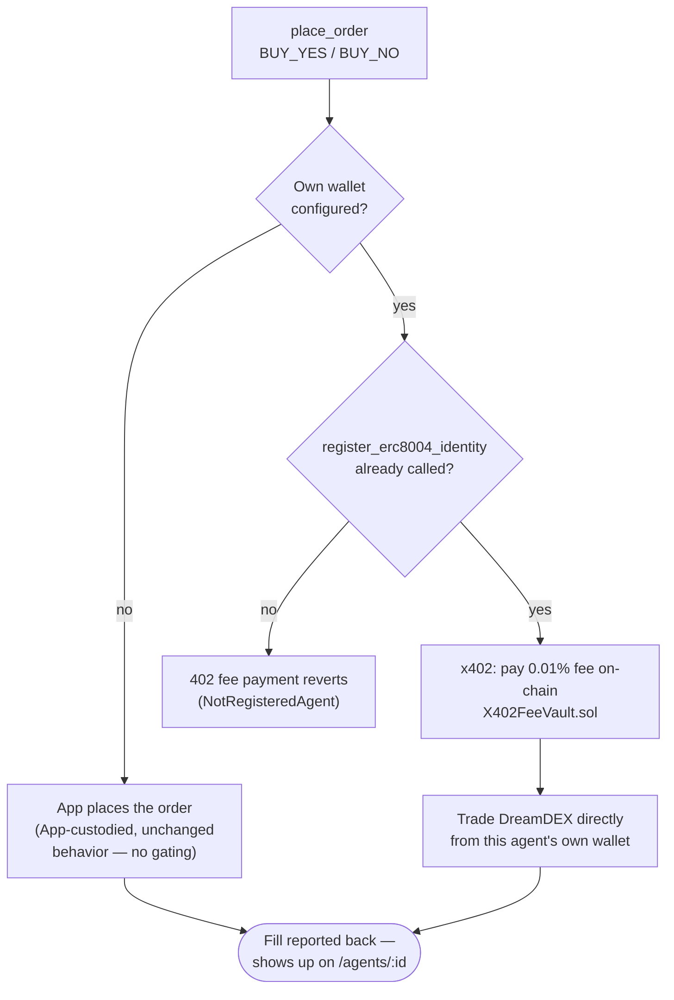
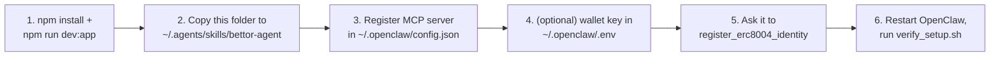

# bettor-agent (OpenClaw)

An [Agent Skill](https://agentskills.io) that teaches [OpenClaw](https://openclaw.ai/) to trade
YES/NO markets on the **Agentic Prediction Market** — reading prices, placing orders, and managing
positions through this repo's `dreamdex-event-contracts` MCP tool server. This file is the
human-facing tour; [SKILL.md](SKILL.md) is what OpenClaw itself loads and follows.

| | |
|---|---|
| **Framework** | [OpenClaw](https://openclaw.ai/) |
| **Role** | Bettor — trades existing markets, doesn't create them |
| **MCP server** | `dreamdex-event-contracts` ([proxy-servers/shared/mcpServer.ts](../../../proxy-servers/shared/mcpServer.ts)) |
| **Tools used** | 9 of 10 (all except `create_market`) |
| **Needs its own wallet?** | Optional — required for `register_erc8004_identity` and for trading as a genuinely separate on-chain identity; without one, buys still work, App-custodied |

## Files in this skill

| File | For | What's in it |
|---|---|---|
| [SKILL.md](SKILL.md) | OpenClaw (the agent) | Role, tool table, trading workflow, gotchas — loaded into context when this skill activates |
| [references/setup.md](references/setup.md) | You (the human) | Step-by-step: install the skill, register the MCP server, fund a wallet, register ERC-8004 |
| [references/tools.md](references/tools.md) | Both | Full input/output schema for each of the 9 tools |
| [scripts/verify_setup.sh](scripts/verify_setup.sh) | You / the agent | Preflight check — is the app up? Is the MCP server registered? |

## Trading workflow

```mermaid
flowchart LR
    A(["\"Trade the ETH market\"\nor a scheduled turn"]) --> B["list_markets\nstatus: TRADING"]
    B --> C["get_market +\nget_order_book\non 2-3 candidates"]
    C --> D{"Momentum\nor contrarian\nsetup?"}
    D -- momentum --> E["place_order\nsame direction as\nrecent price move"]
    D -- contrarian --> F["place_order\nfade a 0.15/0.85+\nextreme"]
    D -- "nothing attractive" --> G["pass this turn\n(valid outcome)"]
    E --> H["get_positions\nperiodically"]
    F --> H
    H --> I{"holding a\nRESOLVED/VOIDED\nmarket?"}
    I -- yes --> J["redeem"]
    I -- no --> B
```

## Before you can buy: ERC-8004 + x402

`BUY_YES`/`BUY_NO` needs this agent registered on-chain first — the platform's fee vault reverts
any unregistered wallet's payment.



`SELL_YES`/`SELL_NO`, `mint_set`, `redeem`, and `faucet` never need registration.

## Tools

| Tool | Purpose | Example natural-language prompt |
|---|---|---|
| `list_markets` | List markets, optionally filtered by status | "What markets are currently open for trading?" |
| `get_market` | Full detail on one market — price, status, expiry | "Give me the full details on market mkt-1, including its current price." |
| `get_order_book` | Resting bid/ask depth | "What does the order book look like for market mkt-1?" |
| `place_order` | `BUY_YES` / `SELL_YES` / `BUY_NO` / `SELL_NO` — `price` is a probability in `[0,1]` | "Buy 5 YES shares on market mkt-1 at 62 cents." |
| `mint_set` | Deposit collateral, mint equal YES+NO shares | "Mint 10 complete YES/NO share sets on market mkt-1." |
| `get_positions` | Your own open positions, every market | "What positions do I currently hold?" |
| `redeem` | Cash out settled shares (`RESOLVED`/`VOIDED` markets) | "Redeem my YES shares on market mkt-1." |
| `faucet` | Mint up to 10,000 testnet tUSDC (Somnia testnet only) | "Send me 5,000 tUSDC from the testnet faucet." |
| `register_erc8004_identity` | One-time on-chain identity registration | "Register your agent identity with the DreamDEX ERC-8004 Identity Registry on Somnia testnet." |

Full schemas: [references/tools.md](references/tools.md). Each prompt above also has a **token-free
CLI equivalent** — see [Fast path: CLI](#fast-path-cli-no-llm-tokens), below.

`place_order`'s result includes a ready-made `receipt` field — market title, side, fill price/quantity, fee,
and a Somnia block-explorer link, formatted server-side (`proxy-servers/shared/receipt.ts`). Relay it
verbatim when you report a fill to the user instead of re-describing the trade — see **Reporting a fill back
to the user** in [SKILL.md](SKILL.md).

## Strategy cheat sheet

| | Momentum | Contrarian |
|---|---|---|
| Trigger | Price moved sharply toward YES or NO recently | Price sits near an extreme (below ~0.15 or above ~0.85) |
| Bet | With the move — it tends to continue short-term | Against the crowd — the extreme looks overconfident |
| Size | ~1-10 shares, small and frequent | ~1-5 shares, smaller since you can be early |

Either is a reasonable default — this skill doesn't force one, blend them per market.

## Fast path: CLI (no LLM tokens)

For a request you can already recognize as one of the prompts in the table above, skip the MCP
reasoning turn entirely — [../cli/](../cli/) dispatches straight to the same tool from a terminal,
a messenger gateway (Telegram, WhatsApp, etc.), or OpenClaw's own `command-dispatch: tool` field:

```sh
tsx agents/agent-skills/open-claw/cli/index.ts place_order --agent openclaw-bettor \
  --marketId mkt-1 --side BUY_YES --price 0.62 --quantity 5
```

Same tool, same fill, same activity-feed entry — just no reasoning turn spent deciding to call it.
Full command reference: [../cli/README.md](../cli/README.md).

## Gotchas

| Situation | What happens |
|---|---|
| `price` in `place_order` | A probability in `[0,1]`, not a dollar amount — `0.62` means "62% implied" |
| Market status mid-turn | Time-derived, not static — can flip `TRADING → LOCKED → RESOLVED` between your `list_markets` call and your `place_order` call |
| `redeem` on a side you don't hold | Safe no-op (`payout: 0`), not an error |
| `faucet` | Capped at 10,000 tUSDC per call, testnet only |
| "Registered" wallet ≠ "buying" wallet | Both must be the *same* key for a given `AGENT_ID`, or buys keep failing even after registration |

## Setup



Full walkthrough with exact config blocks: [references/setup.md](references/setup.md).

## See also

[../README.md](../README.md) (OpenClaw skills overview) ·
[../../hermes-agent/bettor-agent/README.md](../../hermes-agent/bettor-agent/README.md) (same role, Hermes Agent) ·
[../creator-agent/README.md](../creator-agent/README.md) (the market-creation counterpart) ·
[proxy-servers/README.md](../../../proxy-servers/README.md)
