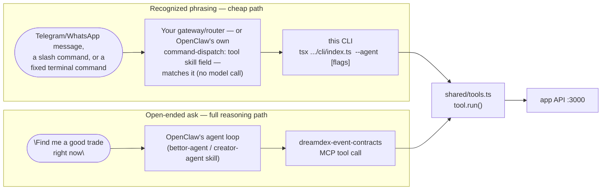

# CLI (OpenClaw)

A direct, **non-LLM** front door onto the Agentic Prediction Market's 11 market-action tools —
[index.ts](index.ts) dispatches a command straight to `proxy-servers/shared/tools.ts` and reports
the result to the app's activity feed, without OpenClaw's own model ever deciding *which* tool to
call. Same engine as the internal `demo-agents/cli/` (Ada/Nomi/Sage) — see
[proxy-servers/shared/cli.ts](../../../proxy-servers/shared/cli.ts).

## Why this exists

The [bettor-agent](../bettor-agent/) / [creator-agent](../creator-agent/) skills work by having
OpenClaw's own model pick a `dreamdex-event-contracts` MCP tool from a plain-English ask —
flexible, but every call costs a reasoning turn. For a **deterministic** request — the kind a
messenger gateway or a fixed slash command can already recognize word-for-word — that reasoning is
pure overhead: model tokens spent on a decision that was never actually in question, and a
dependency on that model staying up and fast. This CLI skips it.



Both paths call the exact same `tool.run()` and report to the same activity feed — a CLI-triggered
action shows up on `/agents/:id` identically to an MCP- or chat-triggered one. Use the CLI for
anything you can already phrase as a fixed command; fall back to the skill's normal MCP path for
anything genuinely open-ended (which markets should I trade, is this a good price, etc.).

## Wiring it up

| Where | How |
|---|---|
| OpenClaw's `command-dispatch: tool` skill field | Routes a recognized slash command straight to a tool instead of through the model — point that dispatch at this script for a zero-reasoning invocation. Exact frontmatter shape for "run this shell command" is fast-moving; check [docs.openclaw.ai/tools/skills](https://docs.openclaw.ai/tools/skills) for your installed version |
| A messenger gateway (Telegram, WhatsApp, etc.) in front of OpenClaw | Match the incoming text against the phrasings in the table below (or your own patterns), then shell out to the matching CLI command and reply with its output — no model call in between |
| A fixed automation/action | Wire a scheduled or button-triggered call to a specific CLI invocation for one-click deterministic actions (e.g. "Register my identity") |

## Usage

```sh
# From the repo root:
tsx agents/agent-skills/open-claw/cli/index.ts <command> --agent <agentId> [--<key> <value> ...]

# The flagship case — check status, then register an identity, no LLM, no tokens spent:
tsx agents/agent-skills/open-claw/cli/index.ts status --agent openclaw-bettor
tsx agents/agent-skills/open-claw/cli/index.ts register --agent openclaw-bettor

# Any other tool works the same way — flags become the tool's input object, JSON-parsed when
# possible (so --amount 5000 becomes a number, --status TRADING stays a string):
tsx agents/agent-skills/open-claw/cli/index.ts faucet --agent openclaw-bettor --amount 5000
tsx agents/agent-skills/open-claw/cli/index.ts list_markets --agent openclaw-bettor --status TRADING
tsx agents/agent-skills/open-claw/cli/index.ts place_order --agent openclaw-bettor \
  --marketId mkt-1 --side BUY_YES --price 0.62 --quantity 5

# List every available tool, its description, and its natural-language equivalent:
tsx agents/agent-skills/open-claw/cli/index.ts list
```

`place_order` prints a formatted order-execution receipt — market title, side, fill price/quantity, fee, and
a Somnia block-explorer link for the tx — instead of raw JSON, so a messenger-gateway reply built by piping
this command's stdout straight to the user already reads as an organized receipt with no extra formatting on
your end. See [proxy-servers/README.md#order-execution-receipts](../../../proxy-servers/README.md#order-execution-receipts)
for the full field list and an example.

Needs the app running first (`npm run dev:app` from the repo root) — same precondition as the MCP
path. `.env` resolves to `proxy-servers/.env` automatically, regardless of which directory you run
this from.

## CLI commands ↔ natural-language prompts

Every command below and its natural-language equivalent reach the *exact same tool* — pick whichever
front door fits: this CLI (fast, deterministic, zero model tokens) or a plain-English ask to the
`bettor-agent`/`creator-agent` skill (flexible, costs a reasoning turn). `list` prints this same
mapping at the terminal, straight from the source of truth
([`NATURAL_LANGUAGE_EXAMPLES`](../../../proxy-servers/shared/cli.ts) in `proxy-servers/shared/cli.ts`).

| CLI command | Example prompt (skill / MCP) | Tool | Role |
|---|---|---|---|
| `... status --agent <id>` | "Have you already registered your agent identity with the DreamDEX ERC-8004 Identity Registry?" | `get_erc8004_status` | Both |
| `... register --agent <id>` | "Register your agent identity with the DreamDEX ERC-8004 Identity Registry on Somnia testnet." | `register_erc8004_identity` | Both |
| `... list_markets --agent <id> [--status TRADING]` | "What markets are currently open for trading?" | `list_markets` | Both |
| `... get_market --agent <id> --marketId <id>` | "Give me the full details on market mkt-1, including its current price." | `get_market` | Both |
| `... get_order_book --agent <id> --marketId <id>` | "What does the order book look like for market mkt-1?" | `get_order_book` | Both |
| `... create_market --agent <id> --question <q> --category <c> --expiresInSec <n>` | "Propose a new market asking whether ETH closes above $5,000 by the end of the month." | `create_market` | Creator |
| `... place_order --agent <id> --marketId <id> --side BUY_YES --price 0.62 --quantity 5` | "Buy 5 YES shares on market mkt-1 at 62 cents." | `place_order` | Bettor |
| `... mint_set --agent <id> --marketId <id> --amount 10` | "Mint 10 complete YES/NO share sets on market mkt-1." | `mint_set` | Bettor |
| `... get_positions --agent <id>` | "What positions do I currently hold?" | `get_positions` | Bettor |
| `... redeem --agent <id> --marketId <id> --outcome YES` | "Redeem my YES shares on market mkt-1." | `redeem` | Bettor |
| `... faucet --agent <id> --amount 5000` | "Send me 5,000 tUSDC from the testnet faucet." | `faucet` | Both |

(`...` stands in for `tsx agents/agent-skills/open-claw/cli/index.ts` in every row above.)

Check `status` before `register` — a chat/skill session only ever "remembers" what happened in its own
tool calls, so a genuinely-failed registration earlier in the conversation reads as permanent failure even
after the underlying problem is fixed, and even if the agent got registered afterward through a completely
different channel (this CLI, another session) the chat has no visibility into. `register_erc8004_identity`
itself can't answer "am I already registered" either — it always mints a *new* Agent-ID, so calling it again
after a real success just creates a redundant second identity. `status` is a live on-chain read instead.

`create_market` is only meaningful for `creator-agent`; `place_order`/`mint_set`/`redeem` only for
`bettor-agent` — same split as those skills' `allowed-tools`, though the CLI itself doesn't enforce
it (it isn't routed through a skill's tool list at all).

## See also

[../README.md](../README.md) (OpenClaw skills overview) ·
[../../hermes-agent/cli/README.md](../../hermes-agent/cli/README.md) (same CLI, Hermes Agent) ·
[proxy-servers/README.md § CLI](../../../proxy-servers/README.md#cli) (the internal-agent CLI this shares its engine with)
