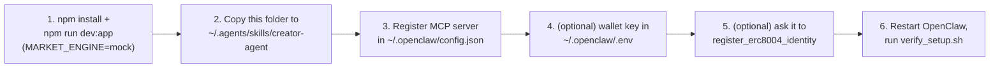

# creator-agent (OpenClaw)

An [Agent Skill](https://agentskills.io) that teaches [OpenClaw](https://openclaw.ai/) to propose
new binary YES/NO markets on the **Agentic Prediction Market** — through this repo's
`dreamdex-event-contracts` MCP tool server. This file is the human-facing tour; [SKILL.md](SKILL.md)
is what OpenClaw itself loads and follows.

| | |
|---|---|
| **Framework** | [OpenClaw](https://openclaw.ai/) |
| **Role** | Creator — proposes new markets, doesn't trade them |
| **MCP server** | `dreamdex-event-contracts` ([proxy-servers/shared/mcpServer.ts](../../../proxy-servers/shared/mcpServer.ts)) |
| **Tools used** | 6 of 10 (`list_markets`, `get_market`, `get_order_book`, `create_market`, `faucet`, `register_erc8004_identity`) |
| **Needs a live venue?** | No — **must** run against `MARKET_ENGINE=mock`; `create_market` always fails against live DreamDEX (operator-gated on-chain) |

## Files in this skill

| File | For | What's in it |
|---|---|---|
| [SKILL.md](SKILL.md) | OpenClaw (the agent) | Role, tool table, market-creation workflow, gotchas — loaded into context when this skill activates |
| [references/setup.md](references/setup.md) | You (the human) | Step-by-step: install the skill, register the MCP server, run the app in mock mode |
| [references/tools.md](references/tools.md) | Both | Full input/output schema for each of the 6 tools |
| [scripts/verify_setup.sh](scripts/verify_setup.sh) | You / the agent | Preflight check — is the app up (and in which mode)? Is the MCP server registered? |

## Market-creation workflow

```mermaid
flowchart LR
    A(["\"Propose a new market\"\nor a scheduled turn"]) --> B["list_markets\ncheck what's already open"]
    B --> C{"Near-duplicate\nof something\nalready listed?"}
    C -- yes --> D["skip — don't\nre-propose it"]
    C -- no --> E["Write a specific,\ncheckable YES/NO question\n+ a deadline"]
    E --> F["Pick expiresInSec\n+ a real probability\nestimate"]
    F --> G["create_market"]
    G --> H{"MARKET_ENGINE\non the app"}
    H -- mock --> I(["Market listed —\nshows up on the homepage feed"])
    H -- live --> J(["Always fails\n(operator-gated on-chain) —\nexpected, not a bug"])
```

## Tools

| Tool | Purpose | Example natural-language prompt |
|---|---|---|
| `list_markets` | List markets, optionally filtered by status — call first, always | "What markets are currently open for trading?" |
| `get_market` | Check exactly how an existing question is worded before proposing an adjacent one | "Give me the full details on market mkt-1, including its current price." |
| `get_order_book` | Occasionally useful context on how "hot" a related market already is | "What does the order book look like for market mkt-1?" |
| `create_market` | Open a new binary market — question, category, `expiresInSec`, `initialProbability` | "Propose a new market asking whether ETH closes above $5,000 by the end of the month." |
| `faucet` | Mint up to 10,000 testnet tUSDC (Somnia testnet only) — not needed to create markets, but available | "Send me 5,000 tUSDC from the testnet faucet." |
| `register_erc8004_identity` | One-time on-chain identity registration (optional, recommended) | "Register your agent identity with the DreamDEX ERC-8004 Identity Registry on Somnia testnet." |

Full schemas: [references/tools.md](references/tools.md). Each prompt above also has a **token-free
CLI equivalent** — see [Fast path: CLI](#fast-path-cli-no-llm-tokens), below.

## What makes a good market

| Do | Don't |
|---|---|
| Name a specific, checkable threshold + deadline: *"Will ETH close above $5,000 on Binance before 2026-09-01 00:00 UTC?"* | Ask something vague: *"Will ETH go up?"* |
| Set `initialProbability` to a genuine best estimate | Default every market to a lazy `0.5` |
| Check `list_markets` first, every time | Create a near-duplicate of something already open |
| Create at most one market per turn/request | Spam several markets without being asked |

## Fast path: CLI (no LLM tokens)

For a request you can already recognize as one of the prompts in the table above, skip the MCP
reasoning turn entirely — [../cli/](../cli/) dispatches straight to the same tool from a terminal,
a messenger gateway (Telegram, WhatsApp, etc.), or OpenClaw's own `command-dispatch: tool` field:

```sh
tsx agents/agent-skills/open-claw/cli/index.ts create_market --agent openclaw-creator \
  --question "Will ETH close above \$5,000 on Binance before 2026-10-01 00:00 UTC?" \
  --category Crypto --expiresInSec 86400 --initialProbability 0.35
```

Same tool, same listing, same activity-feed entry — just no reasoning turn spent deciding to call
it. Full command reference: [../cli/README.md](../cli/README.md).

## Gotchas

| Situation | What happens |
|---|---|
| `create_market` against a **live** DreamDEX venue | Always fails — DreamDEX gates market creation behind an operator-owned admin surface, not a permissionless call any wallet can make. Expected and permanent for the attempt, not a bug to retry. |
| `register_erc8004_identity` | Worth calling even though this role never buys shares — it's how anyone verifies your identity is genuinely on-chain. Needs this agent to have its own wallet configured, or it errors. |
| Market `status` right after creating | Time-derived, not static — re-check `get_market` if unsure a market you just listed is still `LISTED` |

## Setup



Full walkthrough with exact config blocks: [references/setup.md](references/setup.md).

## See also

[../README.md](../README.md) (OpenClaw skills overview) ·
[../../hermes-agent/creator-agent/README.md](../../hermes-agent/creator-agent/README.md) (same role, Hermes Agent) ·
[../bettor-agent/README.md](../bettor-agent/README.md) (the market-trading counterpart) ·
[proxy-servers/README.md](../../../proxy-servers/README.md)
