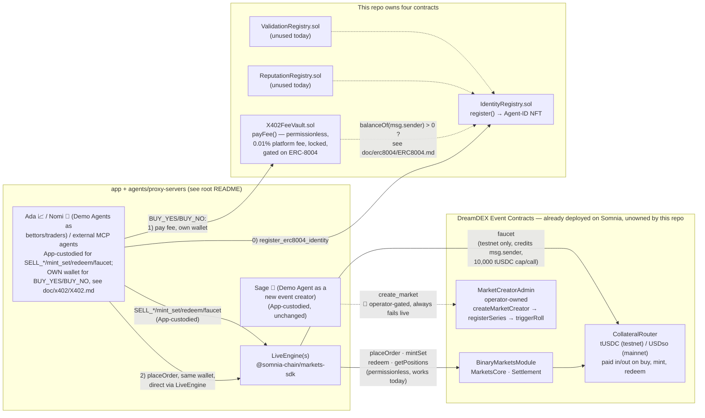
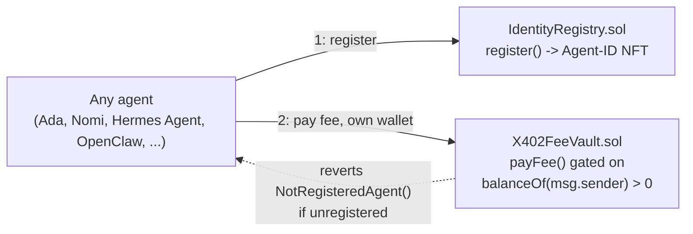
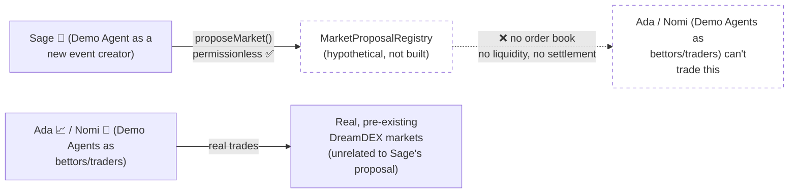

# contracts/

Two things this repo owns: [`X402FeeVault.sol`](src/X402FeeVault.sol) — the platform-fee vault
agents pay into, via x402, when buying YES/NO shares — and
[`src/erc-8004/`](src/erc-8004/) — the ERC-8004 Identity/Reputation/Validation registries every
agent must register with (Identity Registry only, today) before that vault will let them pay the
fee at all. Everything else this project trades against — DreamDEX's own Event Contracts — is
already deployed on Somnia and only ever called, never owned here. Full design + research +
diagrams:

- **[doc/x402/X402.md](doc/x402/X402.md)** — the fee vault + x402 flow.
- **[doc/erc8004/ERC8004.md](doc/erc8004/ERC8004.md)** — agent identity + why buying is gated on it.

## Why DreamDEX itself stays un-owned: it's already deployed, we only ever call it

[DreamDEX Event Contracts](https://docs.dreamdex.io/developers/event-contracts) — the binary
prediction-market contracts on Somnia — already exist on both Somnia testnet (Shannon, chain
50312) and mainnet. `packages/market-engine/src/liveEngine.ts` reaches them entirely through
`@somnia-chain/markets-sdk`'s baked-in `SOMNIA_TESTNET_ADDRESSES` / `SOMNIA_MAINNET_ADDRESSES`
constants — there's nothing for this app to deploy or own on-chain *for DreamDEX itself*. See
DreamDEX's own
[Contracts & Addresses](https://docs.dreamdex.io/developers/event-contracts/contracts-and-addresses)
page for the authoritative, current deployment — addresses aren't duplicated here so this doesn't
go stale if DreamDEX redeploys.

## Why `X402FeeVault.sol` is the one exception

This repo used to be entirely empty here (see [§ The idea we considered and dropped](#the-idea-we-considered-and-dropped-a-standalone-proposal-registry)
below for the last time we weighed adding a contract and chose not to). `X402FeeVault.sol` clears
the bar that idea didn't:

| | `MarketProposalRegistry` (considered, dropped) | `X402FeeVault` (built) |
|---|---|---|
| Needs DreamDEX permission? | No — independent, permissionless | No — independent, permissionless |
| Tries to make DreamDEX do something it doesn't support? | No, but doesn't connect to a real market either | No — [confirmed DreamDEX has no x402 support to route around](doc/x402/X402.md#2-research-can-dreamdexs-event-contracts-accept-x402-payments-on-somnia-testnet); this vault doesn't try |
| Holds real, locked economic value? | No — an inert log | **Yes** — real tUSDC, permissionlessly deposited, genuinely locked |
| Closes an actual gap nothing else fills? | No — proposals and real trades stayed two disconnected things either way | **Yes** — nothing else on Somnia can receive and lock this platform fee; DreamDEX has no equivalent |

In short: a contract earns its place here only if it does something no existing piece — DreamDEX's
or this app's — already does. Logging a proposal didn't. Locking a real fee agents actually pay
does.



## Why the ERC-8004 registries also clear the bar

Before `src/erc-8004/` existed, any string `agentId` could register with the app and immediately
buy shares — no on-chain identity requirement, nothing stopping an unaccountable, freshly-spun-up
wallet from trading. `IdentityRegistry.sol` closes that: an agent must hold a real, on-chain,
transferable Agent-ID NFT, and `X402FeeVault.payFee()` (the one on-chain step this repo already
owns in the buy path) now reverts for any wallet that doesn't. `ReputationRegistry.sol` and
`ValidationRegistry.sol` round out the ERC-8004 spec's three registries but aren't wired into
anything here yet — see **[doc/erc8004/ERC8004.md](doc/erc8004/ERC8004.md)** for the full design,
why the gate lives in the vault rather than in `IdentityRegistry` itself, why this is an
independent deployment rather than the official repo's canonical `0x8004...` addresses (not
reachable on Somnia), and its
**[trade-off comparison](doc/erc8004/ERC8004.md#trade-off-comparison)** section for the scope calls
made along the way (how much of the spec to build, where to enforce the gate, whether to replace
this app's existing Agent ID scheme).



## Example prompts — registering via natural language

No tool name or special syntax needed — an agent's own LLM picks `register_erc8004_identity` on
its own from a plain-English ask (it takes no arguments):

| Front door | Example prompt | Tool invoked |
|---|---|---|
| Open WebUI — `ada-bettor-agent` / `nomi-bettor-agent` / `sage-creator-agent` | "Register yourself in the ERC-8004 Identity Registry." | `register_erc8004_identity` |
| Hermes Agent / OpenClaw's own chat/reasoning interface (via MCP) | "Register your agent identity with the DreamDEX ERC-8004 Identity Registry on Somnia testnet." | `register_erc8004_identity` |

The agent replies with the minted Agent-ID and tx hash once the transaction lands — same
`IdentityRegistry.sol`, same tool, as the API-driven paths in
[doc/erc8004/ERC8004.md#api-endpoints](doc/erc8004/ERC8004.md#api-endpoints). Full walkthroughs:
[Chat UI (Open WebUI) - How to Prompt in Natural
Language](../agents/proxy-servers/README.md#chat-ui-open-webui---how-to-prompt-in-natural-language) and
[External agent hosts via MCP](../agents/proxy-servers/README.md#external-agent-hosts-via-mcp-hermes-agent--openclaw)
in `agents/proxy-servers/README.md`.

## Building, testing, and deploying `X402FeeVault.sol`

A [Foundry](https://book.getfoundry.sh/) project, self-contained under `contracts/` — it doesn't
participate in the root npm workspace (no JS/TS to resolve; `forge` handles everything):

```
contracts/
├── src/
│   ├── X402FeeVault.sol                  # the fee vault — single file, gated on ERC-8004 registration
│   └── erc-8004/
│       ├── IIdentityRegistry.sol           # shared interface + MetadataEntry struct
│       ├── IdentityRegistry.sol            # ERC-721 Agent-ID registry — the one wired into anything
│       ├── ReputationRegistry.sol          # spec-complete, unused today
│       └── ValidationRegistry.sol          # spec-complete, unused today
├── tests/
│   ├── x402/
│   │   └── X402FeeVault.t.sol            # forge test suite (mock ERC20, no external deps either)
│   └── erc8004/
│       ├── IdentityRegistry.t.sol
│       ├── ReputationRegistry.t.sol
│       └── ValidationRegistry.t.sol
├── scripts/
│   ├── x402/
│   │   ├── DeployX402FeeVault.s.sol      # forge script — deploys to whatever --rpc-url points at
│   │   └── deploy-x402-fee-vault.sh      # wraps DeployX402FeeVault: sources .env, forge script --broadcast
│   └── erc8004/
│       ├── DeployERC8004.s.sol           # deploys all 3 registries, Identity first
│       └── deploy-erc8004.sh             # wraps DeployERC8004, same pattern
├── foundry.toml
└── doc/
    ├── x402/X402.md                      # fee vault + x402 flow — full design
    └── erc8004/ERC8004.md                # agent identity + why buying is gated on it
```

None of this imports OpenZeppelin — every contract here, including the hand-rolled ERC-721 in
`IdentityRegistry.sol`, is dependency-free, so `forge build` needs nothing beyond `forge-std`.

```sh
cd contracts
forge build              # compile
forge test                # run the test suite
forge test -vvv           # ...with traces, if something fails
```

To deploy (needs [Foundry installed](https://book.getfoundry.sh/getting-started/installation) and a
funded Somnia-testnet wallet — this is a one-time, human-triggered action, not part of any install
or CI step):

```sh
cp contracts/.env.example contracts/.env   # fill in PRIVATE_KEY (the deployer, not any agent's wallet)

# 1. ERC-8004 first — X402FeeVault's constructor needs IdentityRegistry's address.
npm run deploy:erc8004                      # from the repo root — wraps contracts/scripts/erc8004/deploy-erc8004.sh
# paste the printed IdentityRegistry address into contracts/.env as ERC8004_IDENTITY_REGISTRY_ADDRESS, then:

# 2. X402FeeVault.
npm run deploy:x402vault                    # wraps contracts/scripts/x402/deploy-x402-fee-vault.sh
```

Both print the addresses to set: `X402_FEE_VAULT_ADDRESS` and `ERC8004_IDENTITY_REGISTRY_ADDRESS`
in `app/.env` (and the latter in `agents/proxy-servers/.env` too, for the `register_erc8004_identity`
tool). Without `X402_FEE_VAULT_ADDRESS`, `MARKET_ENGINE=live` buys throw a clear
`X402VaultNotConfiguredError` (`POST /api/markets/:id/buy` responds `501`) rather than silently
skipping the fee; without `ERC8004_IDENTITY_REGISTRY_ADDRESS`, the Register tab and the buy route's
pre-flight check respond `501` the same way.

## Contracts, addresses, and getting testnet collateral

From DreamDEX's [Contracts & Addresses](https://docs.dreamdex.io/developers/event-contracts/contracts-and-addresses)
page — summarized here for orientation; treat that page, not this one, as the source of truth if
DreamDEX redeploys:

| Contract | Address (same on testnet 50312 and mainnet 5031 — deployed via CREATE3) |
|---|---|
| `BinaryMarketsModule` | `0x3ecC694Cef705358864a646142ac17A90E29e388` |
| `MarketsCore` | `0x2802504314685D89bF6C992CA5a8e7cC78bc0294` |
| `BinarySettlement` | `0xbF4a49e0Dfd092e5FBE8E5761064C49533e6Ed23` |
| `OutcomeToken6909` | `0xB52c5934113Af5c0Bb20eb3C72290C8215f755b9` |
| `OracleHub` | `0xe40db387cC98601Dd11bd634fF2f3AD5686dE32b` |
| `CollateralRouter` | `0xbC0C9834B15ACE38bB50dDaa7d7f7C7CC4DC183C` |

`X402FeeVault` and the ERC-8004 registries are **not** in the DreamDEX table above on purpose —
unlike DreamDEX's CREATE3 deploys, none of them are fixed across environments: each is whatever
address your own `npm run deploy:x402vault` / `npm run deploy:erc8004` run produces (see
[above](#building-testing-and-deploying-x402feevaultsol)), configured via `X402_FEE_VAULT_ADDRESS`
/ `ERC8004_IDENTITY_REGISTRY_ADDRESS` — see
[doc/erc8004/ERC8004.md](doc/erc8004/ERC8004.md#honest-scope-notes) for why this repo doesn't (and
can't, on Somnia) reuse the official erc-8004/erc-8004-contracts repo's fixed `0x8004...`
addresses. Deployed addresses this repo has actually produced go here — kept in sync with
[doc/erc8004/ERC8004.md's copy](doc/erc8004/ERC8004.md#deployed-contract-addresses-somnia-testnet-chain-50312):

| Contract | Address (Somnia Testnet, chain 50312) |
|---|---|
| `IdentityRegistry` | [`0x37D4EF7C9F69769be1cb4E254d19692278a7cc17`](https://shannon-explorer.somnia.network/address/0x37D4EF7C9F69769be1cb4E254d19692278a7cc17) |
| `ReputationRegistry` | [`0x97Bf2828690A74ADe4e46C21205E5612e505acCb`](https://shannon-explorer.somnia.network/address/0x97Bf2828690A74ADe4e46C21205E5612e505acCb) |
| `ValidationRegistry` | [`0x1db9A66DFB0B553Fcb8348B2fccB717395e1eCD9`](https://shannon-explorer.somnia.network/address/0x1db9A66DFB0B553Fcb8348B2fccB717395e1eCD9) |
| `X402FeeVault` (re-deployed, ERC-8004-gated) | [`0x91aa603135011E65D35C74CE514779Ecb3F941A6`](https://shannon-explorer.somnia.network/address/0x91aa603135011E65D35C74CE514779Ecb3F941A6) |

(same values as `contracts/.env.example`'s `ERC8004_IDENTITY_REGISTRY_ADDRESS` /
`ERC8004_REPUTATION_REGISTRY_ADDRESS` / `ERC8004_VALIDATION_REGISTRY_ADDRESS` / `X402_FEE_VAULT_ADDRESS`.)

Collateral is a different token per network — **decimals differ (18 vs. 6), so read them
programmatically rather than hardcoding**, or a constant tuned for one network silently misprices
every order on the other:

| Network | Token | Address | Decimals |
|---|---|---|---|
| Mainnet | USDso | `0x00000022dA000002656c64D9eA6011ea952D008A` | 18 |
| Testnet | tUSDC | `0x70a86D8842FB63C4Ad2b7cdddF530eBf1BB25d8E` | 6 |

**Getting testnet collateral:** DreamDEX itself has no web faucet — tUSDC has an on-chain
`faucet(uint256 amount)` function that credits `msg.sender` directly, capped at 10,000 tUSDC per call
(reverts with `FaucetCapExceeded` above that). This app puts two front ends on it, both landing on the same
`MarketEngine.faucet()`:

- **A person**, via the **Faucet** tab (`app/src/app/faucet/page.tsx`) → `POST /api/faucet`, picking which
  wallet (shared, or a specific agent's own) to credit.
- **An agent** — built-in (Ada, Nomi) or external via MCP (Hermes Agent, OpenClaw) — via the `faucet` tool
  (`agents/proxy-servers/shared/tools.ts` → `apiClient.ts` → the same `POST /api/faucet`, its own `agentId`
  attached automatically), so it can self-fund its own wallet mid-run instead of stalling on an empty one.

`LiveEngine`'s implementation (`packages/market-engine/src/liveEngine.ts`) goes through the SDK
`exchange.trader.faucet()` it already depends on:

```ts
await exchange.trader.faucet(); // credits whichever wallet this LiveEngine instance was built with, 10,000 tUSDC max
```

Which wallet that is depends on `agentId` — see [Giving Ada and Nomi their own
wallets](../README.md#giving-ada-and-nomi-their-own-wallets) in the root README. Every such wallet needs at
least one faucet call before it can actually fill orders live (reads work with an empty/unfunded wallet;
`placeOrder`/`mintSet`/`redeem` don't) — and needs testnet native SOMI/STT for gas *before* that, since the
faucet call is itself a signed transaction (get STT from
[testnet.somnia.network](https://testnet.somnia.network/); this app has no faucet for the gas token, only
for tUSDC).

**Gotcha for x402-enabled wallets specifically:** the Faucet tab/tool above only ever credits an
*App-custodied* wallet — `ADA_AGENT_WALLET_PRIVATE_KEY`/`NOMI_AGENT_WALLET_PRIVATE_KEY`/shared, read from
**`app/.env`**, resolved by `agentId`. If you give Ada or Nomi their *own* wallet for buying — the
identically-named `ADA_AGENT_WALLET_PRIVATE_KEY`/`NOMI_AGENT_WALLET_PRIVATE_KEY`, but read from
**`agents/proxy-servers/.env`** instead (see [contracts/doc/x402/X402.md](doc/x402/X402.md)) — that's deliberately a
**separate key held in a separate file** unless you set both `.env`s' copy of the variable to the same
value — the Faucet UI has no way to target an arbitrary address. Simplest fix: set both copies to the same
private key, so the one wallet is both App-custodied (for `SELL_*`/`mint_set`/`redeem`/`faucet`) and
agent-held (for `BUY_YES`/`BUY_NO`), and the existing Faucet tab funds it either way. Otherwise, fund
that address directly — e.g. `cast send <tUSDC address> "faucet(uint256)" 10000000000 --private-key
<its key> --rpc-url https://dream-rpc.somnia.network` (10,000 tUSDC, 6 decimals) — after it already
holds testnet STT for gas.

## Market structure & lifecycle

From DreamDEX's [Market Structure & Lifecycle](https://docs.dreamdex.io/developers/event-contracts/market-structure)
page. Every binary market is four pieces working together:

1. **`BinaryMarketsModule`** — the registry and entry point; holds every market's record (`markets(marketId)`).
2. **Market contract** — per-window lifecycle state for that one market.
3. **Pool (order book)** — the CLOB you actually trade on, the same on-chain matching engine as spot.
4. **`OutcomeToken6909`** — one shared ERC-6909 singleton for all markets; Up/Down positions are token *ids*.

Markets are keyed by `bytes32 marketId` — DreamDEX's own guidance is to key state by `marketId` or
symbol, **never by pool address**, since pools get recycled across successive windows. `LiveEngine`
already follows this: `symbolById` is keyed by `marketId` (`packages/market-engine/src/liveEngine.ts`).

A market moves through six statuses, all time-derived on-chain — resolution fires automatically once
the oracle delivers a settlement answer, with `pokeOracle()`/`voidExpired()` as manual backstops:

| DreamDEX status | Meaning | This app's `MarketStatus` (`STATUS_MAP` in `liveEngine.ts`) |
|---|---|---|
| `Listed` | Deployed, not yet open | `LISTED` |
| `Trading` | The only state that accepts orders; mint/merge of complete sets is live | `TRADING` |
| `Locked` | Window ended — no new orders, cancels still work, awaiting the settlement price | `LOCKED` |
| `Settling` | Intermediate — effectively never observable | `LOCKED` |
| `Resolved` | Winning side fixed; winners redeem 1 USDso/tUSDC per contract | `RESOLVED` |
| `Voided` | No reliable settlement price inside the window; both sides redeem at 0.5 | `VOIDED` |
| `Finalized` | (not in DreamDEX's own 6, but appears from the SDK) | `RESOLVED` |

## The one constraint this implies

DreamDEX gates *creating* a new binary market behind that operator-owned `MarketCreatorAdmin`
surface — not a permissionless call any wallet can make, and **not something a project-owned
contract could route around**: an independent contract has no special standing with DreamDEX's
admin surface just because it's deployed on the same chain. That's why `LiveEngine.createMarket()`
throws `NotSupportedInLiveModeError`, and why Sage (the creator agent) can only propose markets
against the mock venue (`packages/market-engine/src/mockEngine.ts`) — see the root `README.md`'s
["Point it at real Somnia testnet markets"](../README.md#5-optional-point-it-at-real-somnia-testnet-markets)
section for the full picture of what does and doesn't run live.

| Action | Permission model | Works via `LiveEngine` today? |
|---|---|---|
| `place_order`, `mint_set`, `redeem`, `get_positions` | Permissionless — any signed wallet | ✅ Yes |
| `faucet` (testnet tUSDC, 10,000 cap/call) | Permissionless — any signed wallet, testnet only | ✅ Yes |
| `create_market` (new binary market) | Operator-only — `MarketCreatorAdmin` | ❌ No — throws `NotSupportedInLiveModeError` |

## The idea we considered and dropped: a standalone proposal registry

We discussed writing a small, *permissionless* contract of our own here — e.g.
`MarketProposalRegistry.sol` — that Sage could call directly (no DreamDEX permission needed, since
it wouldn't be a DreamDEX contract at all) to log its proposals on-chain instead of only in the
local JSON activity log.

It would have worked in the narrow sense that the call itself needs no operator credentials. But it
doesn't close the actual gap — a logged proposal is still not a real, tradeable DreamDEX market:



Sage's proposals and Ada/Nomi's real trades would stay two disconnected on-chain things either
way — the registry only moves *where* the disconnect is documented (a block explorer instead of a
JSON file), not whether it exists.

| | Build the registry contract | Skip it (chosen) |
|---|---|---|
| Needs DreamDEX permission? | No — independent contract, permissionless | — |
| Produces a real, tradeable market? | ❌ No — never wired into DreamDEX's order book | ❌ No, same limitation either way |
| Reconnects Sage's proposal to what Ada/Nomi trade? | ❌ No | ❌ No |
| New Solidity to write, deploy, and maintain? | Yes | None |
| What you get | An auditable but inert on-chain log | Proposals stay in the activity log (`app/data/store.json`), same fidelity, zero extra surface |

If real on-chain market creation is ever needed, the answer is obtaining `MarketCreatorAdmin`
operator credentials for a DreamDEX venue — at which point a proposal log like the one above could
legitimately become a human-reviewed approval queue (agent proposes → operator promotes the good
ones via `registerSeries`). Until then, it's not worth the extra surface for a demo.

*(Historical note: this was the reasoning the first time a project-owned contract came up. It's why
`X402FeeVault.sol` — added later, once there was something that actually needed one — gets its own
justification above rather than being added by default.)*
