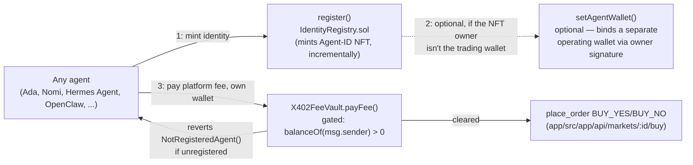

# ERC-8004: agent identity, and why buying is gated on it

[ERC-8004](https://best-practices.8004scan.io/docs/official-specification/erc-8004-official.html)
("Trustless Agents") defines three on-chain registries so any agent — built-in to this app or
external — can hold a portable, verifiable identity: **Identity Registry** (an ERC-721 whose
tokenId is the agent's `agentId`), **Reputation Registry** (on-chain feedback against an
`agentId`), and **Validation Registry** (third-party validation requests/responses against an
`agentId`). This repo implements all three (`contracts/src/erc-8004/`), but only Identity Registry
is wired into anything this app actually does today: **an agent must hold an Agent-ID NFT before
it can buy YES/NO shares.**

## Why buying is gated on registration

Before this existed, any string `agentId` (`"agent-ada"`, `"hermes-trader"`, any external MCP
agent) could register with the app (`POST /api/agents/register`) and immediately place
`BUY_YES`/`BUY_NO` orders — no on-chain identity requirement at all. That's a real gap: nothing
stopped an unaccountable, freshly-spun-up wallet from trading. Requiring an ERC-8004 Agent-ID NFT
closes it — the identity is a real, on-chain, transferable asset, not just a string this app's own
JSON store happens to remember.



## Where the gate actually lives

**On-chain, in `X402FeeVault.payFee()`** (`contracts/src/X402FeeVault.sol`) — not in
`IdentityRegistry` or DreamDEX itself:

- `IdentityRegistry` has no opinion on who can buy anything; it's just an identity registry.
- DreamDEX's own Event Contracts are unowned by this repo (see `contracts/README.md`) — there's no
  way to make DreamDEX itself require an ERC-8004 NFT.
- `X402FeeVault.payFee()` is the one on-chain step this repo fully owns in the buy path (see
  `contracts/doc/x402/X402.md`), so it's the natural, and only real, enforcement point:
  `payFee()` now reverts with `NotRegisteredAgent()` if `identityRegistry.balanceOf(msg.sender)`
  is zero — **checked before any token transfer**, so an unregistered wallet's transaction simply
  fails; it never locks a fee with nothing to show for it.

The app layer (`POST /api/markets/:id/buy`) also pre-checks registration once a wallet is known,
purely as a fast-fail UX nicety — the on-chain check above is what's actually authoritative, and
it's the only thing that fires on an agent's very first-ever buy attempt (before the app has
observed that wallet at all).

## The two-step register-then-trade flow

1. **Register** — a human via the **Register** tab (`app/src/app/register-agent/page.tsx`,
   `POST /api/register-agent`) or an autonomous agent via the `register_erc8004_identity` tool
   (`agents/proxy-servers/shared/tools.ts` → `wallet.ts`'s `registerAgentIdentity`) calls
   `IdentityRegistry.register(agentURI)`. `agentURI` is a self-contained
   `data:application/json;base64,...` URI embedding the spec's agent-registration JSON — no
   external hosting needed for a demo.
2. **(Optional) bind an operating wallet** — if the NFT owner (e.g. an App-custodied wallet a
   human registered from the UI) isn't the same address the agent trades from (e.g. its own
   `ADA_AGENT_WALLET_PRIVATE_KEY`), `setAgentWallet` lets the owner authorize a different operating
   wallet via an EIP-712 signature, without ever handing that wallet's own key to whoever holds
   the NFT. In practice, the simplest setup — and what this app's docs recommend — is registering
   the *same* wallet an agent already trades x402 with, exactly like the existing "set both env
   vars to the same key" guidance for x402 (`contracts/README.md`).
3. **Trade** — `place_order` BUY_YES/BUY_NO runs the existing x402 flow; `payFee()` now succeeds
   only because that wallet holds ≥1 Agent-ID NFT.

**`register_erc8004_identity`/`get_erc8004_status` fail with `ERC8004_IDENTITY_REGISTRY_ADDRESS is
not set`, even though it's set in `agents/proxy-servers/.env`?** `agents/proxy-servers/shared/wallet.ts` re-reads
`.env` fresh on every call (`refreshEnv()`), so this can no longer be a stale, already-running
process — only one thing left to check: the file defines the variable **twice**, with a later blank
line silently clobbering an earlier real value (`dotenv` keeps whichever occurrence comes last, no
warning either way). See the troubleshooting table in
[agents/proxy-servers/README.md](../../../agents/proxy-servers/README.md#troubleshooting) for the exact command
(`grep -c` for a duplicate) and why the staleness half of this got fixed for good.

## API endpoints

Everything below is app-owned HTTP (`app/src/app/api/**`), except `register_erc8004_identity`,
which is an `agents/proxy-servers` tool/MCP call that reaches `IdentityRegistry` directly — it's the actual
"API" an autonomous agent calls to register and get its Agent ID back, so it's included here even
though it isn't an HTTP route.

| Layer | Method | Path / tool | Called by | Purpose | Auth |
|---|---|---|---|---|---|
| agents/proxy-servers | tool / MCP | `register_erc8004_identity` | Autonomous agent (Ada, Nomi, Hermes Agent, OpenClaw) | Signs `IdentityRegistry.register(agentURI)` from that agent's own wallet, then reports the result to the app | Agent's own wallet key (`ADA_AGENT_WALLET_PRIVATE_KEY` etc.) |
| agents/proxy-servers | CLI | `tsx agents/demo-agents/cli/index.ts register --agent <id>` | Anyone with shell access to the repo | Same tool, dispatched directly (`cli/index.ts` → `tool.run()`) with no LLM in the loop at all — see [agents/proxy-servers/README.md#cli](../../../agents/proxy-servers/README.md#cli) | Agent's own wallet key (`ADA_AGENT_WALLET_PRIVATE_KEY` etc.) |
| app | `POST` | `/api/register-agent` | Human, via the **Register** tab | Signs `IdentityRegistry.register(agentURI)` from that agent's App-custodied wallet (`ADA_AGENT_WALLET_PRIVATE_KEY` etc.), binds the result | `x-apm-agent-key` if `APM_AGENT_API_KEY` set |
| app | `POST` | `/api/agents/:id/erc8004` | `register_erc8004_identity` (agents/proxy-servers), after it signs `register()` itself | Records a completed on-chain registration (`erc8004AgentId`, `txHash`) onto the agent's store record | `x-apm-agent-key` if `APM_AGENT_API_KEY` set |
| app | `GET` | `/api/agents/:id/erc8004` | Register tab, Agents page (both the card grid and the registration-status table) | Live on-chain status: `{ registered, erc8004AgentId, walletAddress }`. Always re-checks `IdentityRegistry.balanceOf`/`ownerOf` on-chain — never trusts the store's own `erc8004AgentId` alone — and self-heals the store when it finds a registration the store didn't know about (see "Registration status is checked on-chain, not just read from the store" below) | None |
| app | `POST` | `/api/markets/:id/buy` | `place_order` (BUY_YES/BUY_NO), any agent with its own wallet | The existing x402 fee challenge/verification route — now also pre-checks ERC-8004 registration (fast-fail `403`) before quoting a fee, once the agent's wallet is known | `x-apm-agent-key` if `APM_AGENT_API_KEY` set |

## Registration status is checked on-chain, not just read from the store

`GET /api/agents/:id/erc8004` (`app/src/app/api/agents/[id]/erc8004/route.ts`) treats the chain,
not the app's own JSON store, as the source of truth for "is this wallet registered" — the same
principle §"Why buying is gated on registration" above argues for the buy-gate itself. That
mattered in practice, not just in theory: a wallet registered directly against the contract
(`cast send`, a script — anything outside this app's own `/api/register-agent` /
`register_erc8004_identity` paths), or one where `register()` succeeded on-chain but the follow-up
report-back call to the app failed afterward, would otherwise show "Unregistered" on `/agents`
forever, since nothing had ever told the store.

The fix: the route always re-checks `IdentityRegistry.balanceOf` for the best wallet address it can
resolve — the store's own binding if one exists, otherwise whichever App-custodied wallet
`POST /api/register-agent` would have signed from for that agentId (`resolveAppCustodiedAddress` in
`app/src/lib/engine.ts`) — rather than trusting a cached `erc8004AgentId` alone. If it finds a
registration the store didn't know about, it recovers the actual `agentId` by probing
`ownerOf(1)`, `ownerOf(2)`, ... (`findRegisteredAgentId` in `app/src/lib/erc8004.ts`) — cheap
`eth_call`s, since `IdentityRegistry` mints incrementally from 1 — and self-heals the store via
`bindAgentErc8004Id`/`bindAgentWallet` so later checks are fast (store-first) and the `/agents` page
(both the card grid and its registration-status table, `app/src/app/agents/page.tsx`) shows the
correct status from then on.

(`findRegisteredAgentId` deliberately avoids `eth_getLogs` for this — a `fromBlock: 0` scan across
this deployment's full history hit the public Somnia RPC's 1000-block range cap almost
immediately, and paging around that turned into dozens of slow sequential round trips even for one
recent registration. Probing `ownerOf` is both simpler and has no block-range limit to work around
at all.)

## Contracts

| Contract | What it is | Wired into anything? |
|---|---|---|
| `IdentityRegistry.sol` | ERC-721 + ERC-165, `agentId` = tokenId, minted via `register()` | **Yes** — the buy-gate |
| `ReputationRegistry.sol` | On-chain feedback (`giveFeedback`/`getSummary`/etc.) against an `agentId` | No — spec-complete, unused today |
| `ValidationRegistry.sol` | Third-party validation requests/responses against an `agentId` | No — spec-complete, unused today |

All three are hand-rolled, dependency-free Solidity (no OpenZeppelin import), matching this repo's
existing single-file style (`X402FeeVault.sol`, `contracts/README.md`) — `forge build` needs
nothing beyond `forge-std`.

## Trade-off comparison

Three design forks came up while scoping this, each resolved in favor of the option in **bold**:

**How much of the spec to implement**

| | **All 3 registries (chosen)** | Identity Registry only |
|---|---|---|
| Satisfies "register → NFT → gate buying"? | Yes | Yes |
| Matches the official repo's 3-registry structure? | Yes | No |
| New contracts + tests to write and maintain | `IdentityRegistry` + `ReputationRegistry` + `ValidationRegistry` | `IdentityRegistry` only |
| Anything in this app calls `giveFeedback`/`validationRequest` today? | No | No |
| What you get | A spec-complete set, ready to wire in reputation/validation later without redeploying Identity Registry | Less surface to build/audit, nothing unused sitting in the repo |

**Where "only registered agents can buy" is enforced**

| | **App layer + on-chain (chosen)** | App layer only |
|---|---|---|
| Blocks a direct on-chain `payFee()` call from an unregistered wallet, bypassing this app's API entirely? | Yes — reverts `NotRegisteredAgent()` | No — only requests routed through `POST /api/markets/:id/buy` are checked |
| Requires modifying + re-deploying the already-built `X402FeeVault.sol`? | Yes | No |
| Can an unregistered wallet lock a fee with nothing to show for it? | No — the revert fires before any token transfer | No either, if the app-layer check runs first — but that check can't fire on an agent's very first-ever buy attempt (wallet not yet known to the store) |
| Extra contract surface | One new immutable (`identityRegistry`) + one require in `payFee` | None |
| What you get | A gate that holds even if the app layer is skipped or has a bug | Simplicity, no changes to a contract that already shipped |

**Agent ID scope**

| | **Additive (chosen)** | Full replacement |
|---|---|---|
| Existing URLs (`/agents/agent-ada`), store keys, MCP `AGENT_ID` change? | No | Yes — e.g. `/agents/agent-ada` → `/agents/42` |
| New field | `erc8004AgentId` bound onto the existing `AgentRecord` | None — the ERC-721 tokenId becomes the primary key everywhere |
| Regression risk | Low — no route/component touched to add it | High — nearly every route, component, and env var that threads an `agentId` |
| Matches "replace the Agent ID spec" literally | Partially — the on-chain identity is genuinely new; this app's own id scheme is untouched | Yes, literally, at much higher cost |

See the root README's [environment variables](../../../README.md#environment-variables) table and
[Registering agent identity via ERC-8004](../../../README.md#registering-agent-identity-via-erc-8004)
for how these choices show up day-to-day.

## Honest scope notes

- **Not the official deployment.** The official
  [erc-8004/erc-8004-contracts](https://github.com/erc-8004/erc-8004-contracts) repo's canonical
  `0x8004...` addresses are reached via a pre-mined CREATE2 salt replayed against the SAFE
  Singleton Factory across ~40 major chains (see its
  [VANITY_DEPLOYMENT_GUIDE.md](https://github.com/erc-8004/erc-8004-contracts/blob/master/VANITY_DEPLOYMENT_GUIDE.md)).
  Somnia Shannon testnet isn't among them — confirmed via `cast code
  0x8004A169FB4a3325136EB29fA0ceB6D2e539a432 --rpc-url https://dream-rpc.somnia.network`, which
  comes back empty. Reproducing that exact vanity address would mean standing up the same factory
  + presigned-transaction + UUPS-proxy pipeline — a separate large Hardhat project. This repo
  instead deploys its own plain (non-vanity, non-upgradeable) contracts, same `forge script
  --broadcast` pattern as `X402FeeVault.sol`. The deployed address is whatever your own
  `npm run deploy:erc8004` run produces — not fixed across environments, same caveat
  `contracts/README.md` already gives for `X402FeeVault`.
- **Reputation/Validation are unused today.** They exist because the task asked for the full
  ERC-8004 contract set, not because anything in this app currently calls `giveFeedback` or
  `validationRequest`. If agent reputation ever becomes part of this venue's design, these are
  ready to wire in without redeploying Identity Registry.
- **`getSummary`'s cross-decimals averaging is simplified.** `ReputationRegistry.getSummary`
  averages raw `value`s regardless of each entry's own `valueDecimals` and reports the last
  matching entry's decimals — exact normalization across mixed decimals is left to callers that
  keep a consistent `valueDecimals` convention per `tag1`/`tag2` pair.
- **Agent ID stays additive.** Every existing string `agentId` (`"agent-ada"`, MCP `AGENT_ID`,
  URLs, store keys) is unchanged — see the root README. The ERC-721 tokenId is a new
  `erc8004AgentId` field bound onto the existing agent record, not a replacement.

## How this repo's `IdentityRegistry` compares to the official implementation

The official [erc-8004/erc-8004-contracts](https://github.com/erc-8004/erc-8004-contracts) repo's
Identity Registry lives at
[`contracts/IdentityRegistryUpgradeable.sol`](https://github.com/erc-8004/erc-8004-contracts/blob/master/contracts/IdentityRegistryUpgradeable.sol)
— not the plain `IdentityRegistry.sol` the name might suggest — built on OpenZeppelin's upgradeable
stack (`ERC721URIStorageUpgradeable` + `OwnableUpgradeable` + `UUPSUpgradeable` +
`EIP712Upgradeable`). This repo's [`IdentityRegistry.sol`](../../src/erc-8004/IdentityRegistry.sol)
is spec-compatible at the behavioral level — same `register`/`setAgentURI`/`setMetadata`/
`setAgentWallet` shape, same `agentId` = ERC-721 tokenId model — but not bit-for-bit identical.
Compared line-by-line:

| Aspect | Official (`IdentityRegistryUpgradeable.sol`) | This repo (`IdentityRegistry.sol`) | Spec-relevant? |
|---|---|---|---|
| **Upgradeability** | UUPS proxy: `OwnableUpgradeable` + `UUPSUpgradeable`, `initialize()` behind `onlyOwner`/`_authorizeUpgrade` | Plain, non-upgradeable, no admin/owner role at all — deployed once, immutable | Deliberate, already-documented deviation (see "Not the official deployment" above) |
| **Base implementation** | OpenZeppelin `ERC721URIStorageUpgradeable` + `EIP712Upgradeable` | Hand-rolled ERC-721 + EIP-712, no OZ import | Matches this repo's stated no-dependency style; behaviorally equivalent for the ERC-721 surface |
| **name / symbol** | `"AgentIdentity"` / `"AGENT"` | `"ERC-8004 Agent Identity"` / `"AGENT-ID"` | Cosmetic only — the spec doesn't mandate a string |
| **First `agentId`** | `0` (`_lastId` starts at 0, post-increment) | `1` (`_nextAgentId` starts at 1) | Off-by-one; harmless unless something assumes `agentId` starts at 0 |
| **Metadata value type** | `bytes metadataValue` (arbitrary binary) | `string metadataValue` | **Real discrepancy** — the official contract allows arbitrary bytes; this one restricts metadata to UTF-8 strings, which can't round-trip binary values |
| **`agentWallet`** | A *reserved metadata key* (`"agentWallet"`), auto-set to `msg.sender` on `register()`, auto-**cleared on every transfer** (`_update` override), has `unsetAgentWallet()` | A dedicated `_agentWallets` mapping, **not set on `register()`** (stays unset until `setAgentWallet` is called explicitly), **not cleared on transfer**, no unset function | **Real discrepancy** — the official contract's "a bound wallet doesn't survive an ownership transfer" safety property is absent here: a transferred Agent-ID in this repo keeps the *previous* owner's bound wallet until someone overwrites it |
| **`setAgentWallet` signer** | Verified against **`newWallet`'s own signature** (the new wallet must consent to being bound), supports ECDSA *and* ERC-1271 (smart-contract wallets) | Verified against **the current owner's signature** (the owner authorizes the binding), ECDSA only, no ERC-1271 | **Real discrepancy** — different trust model, and this repo's version can't bind a smart-contract wallet as `newWallet` |
| **`setAgentWallet` replay protection** | `deadline` capped at `block.timestamp + 5 minutes` max, no explicit nonce | Explicit per-`agentId` nonce (`agentWalletNonce`), no cap on how far in the future `deadline` can be | Different mechanism, same goal — not a security gap either way |
| **Mint call** | `_safeMint` (checks `onERC721Received` even on mint) | Raw `_mint` (receiver-check only enforced by `safeTransferFrom`, not by `register()`) | Minor — the official contract refuses to mint to a contract that can't receive ERC-721; this one would let that happen via `register()` |
| **Errors** | `require(..., "string")` | Custom Solidity errors (`error X(); revert X();`) | Style/gas only, not spec-relevant |
| **Contract-level admin** | Yes — an `Ownable` admin key controls upgrades | None — no admin key exists at all | Trade-off: the official contract can patch bugs post-deploy; this one can't, but carries no upgrade-key rug risk |
| **One `agentId` per owner cap** | **Not enforced** — an owner can hold unlimited `agentId`s | **Not enforced** — same as official | Confirms this is not a gap versus the official contract; capping it would be a deviation from *both* |

Worth a deliberate decision rather than "cosmetic only":

1. **`agentWallet` not clearing on transfer.** If an Agent-ID NFT here ever changes hands, the new
   owner inherits the previous owner's bound trading wallet until they notice and call
   `setAgentWallet` again — the official contract clears this automatically on every transfer.
2. **`metadataValue` as `string` instead of `bytes`.** Fine as long as nothing registered here needs
   binary metadata; matching the official `bytes` ABI would matter if another ERC-8004 tool ever
   reads this registry's metadata expecting raw bytes.

## Deploying

```sh
cp contracts/.env.example contracts/.env   # fill in PRIVATE_KEY (the deployer)
npm run deploy:erc8004                      # from the repo root — deploys all 3 registries
# then, with the printed IdentityRegistry address as ERC8004_IDENTITY_REGISTRY_ADDRESS in contracts/.env:
npm run deploy:x402vault                    # re-deploy the vault so payFee() gates on it
```

Set the printed `IdentityRegistry` address as `ERC8004_IDENTITY_REGISTRY_ADDRESS` in both
`app/.env` and `agents/proxy-servers/.env`, and the new `X402FeeVault` address as
`X402_FEE_VAULT_ADDRESS` in `app/.env` (see the root README's environment-variables table).

## Deployed contract addresses (Somnia Testnet, chain 50312)

Not the official erc-8004/erc-8004-contracts vanity `0x8004...` addresses — confirmed absent on
Somnia (`cast code 0x8004A169FB4a3325136EB29fA0ceB6D2e539a432 --rpc-url
https://dream-rpc.somnia.network` returns empty) — these are this repo's own independent
deployment, produced by whoever runs the commands above. Same values as `contracts/.env.example`'s
`ERC8004_IDENTITY_REGISTRY_ADDRESS` / `ERC8004_REPUTATION_REGISTRY_ADDRESS` /
`ERC8004_VALIDATION_REGISTRY_ADDRESS` / `X402_FEE_VAULT_ADDRESS`; kept in sync with
`contracts/README.md`'s copy. Re-run
`npm run deploy:erc8004` / `npm run deploy:x402vault` and update both tables if this repo's
deployment is ever redone.

| Contract | Address | Source |
|---|---|---|
| `IdentityRegistry` | [`0x37D4EF7C9F69769be1cb4E254d19692278a7cc17`](https://shannon-explorer.somnia.network/address/0x37D4EF7C9F69769be1cb4E254d19692278a7cc17) | [`src/erc-8004/IdentityRegistry.sol`](../../src/erc-8004/IdentityRegistry.sol) |
| `ReputationRegistry` | [`0x97Bf2828690A74ADe4e46C21205E5612e505acCb`](https://shannon-explorer.somnia.network/address/0x97Bf2828690A74ADe4e46C21205E5612e505acCb) | [`src/erc-8004/ReputationRegistry.sol`](../../src/erc-8004/ReputationRegistry.sol) |
| `ValidationRegistry` | [`0x1db9A66DFB0B553Fcb8348B2fccB717395e1eCD9`](https://shannon-explorer.somnia.network/address/0x1db9A66DFB0B553Fcb8348B2fccB717395e1eCD9) | [`src/erc-8004/ValidationRegistry.sol`](../../src/erc-8004/ValidationRegistry.sol) |
| `X402FeeVault` (re-deployed, ERC-8004-gated) | [`0x91aa603135011E65D35C74CE514779Ecb3F941A6`](https://shannon-explorer.somnia.network/address/0x91aa603135011E65D35C74CE514779Ecb3F941A6) | [`src/X402FeeVault.sol`](../../src/X402FeeVault.sol) |
