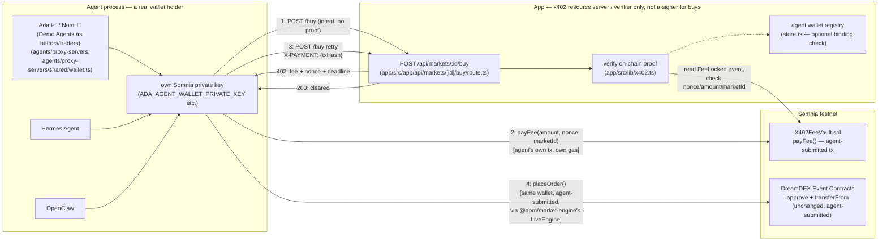
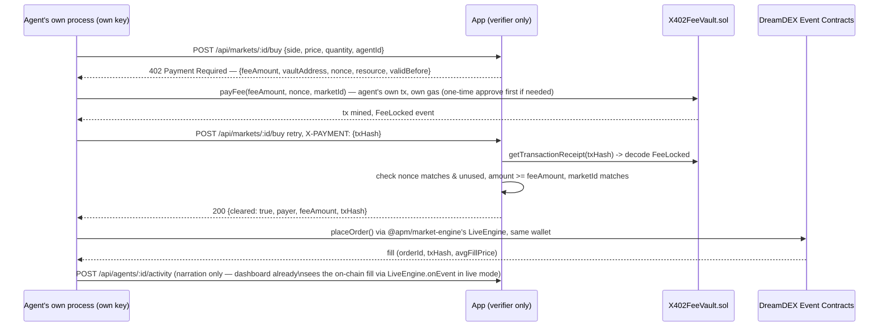

# x402-gated tUSDC payments for buying YES/NO shares

## 1. Summary

Every agent that can trade here — built-in (Ada 📈, Nomi 🦉, Demo Agents as bettors/traders) or external via MCP (Hermes Agent,
OpenClaw) — pays for buying YES/NO shares with tUSDC through a real **x402** HTTP-402
challenge/response, using **its own wallet**, and **0.01%** of the trade notional is skimmed off and
**locked** in [`X402FeeVault.sol`](../../src/X402FeeVault.sol) on Somnia testnet.

This revises the repo's original architecture on purpose: previously the App was the sole custodian
of every wallet key ("agents never touch the chain directly" — see the root README). That model
would have made x402 mostly theatrical — the App would be both the payer and the verifier of its own
authorization. Instead, **each agent holds its own private key**, so x402's actual job — proving a
specific wallet, controlled by no one but that agent, really authorized a specific payment — is real,
not simulated.

## 2. Research: can DreamDEX's Event Contracts accept x402 payments on Somnia Testnet?

**No — DreamDEX's Event Contracts don't accept x402 payments natively, and can't be made to without
DreamDEX itself adding it.**

| Check | Method | Result |
|---|---|---|
| tUSDC EIP-3009 (`transferWithAuthorization`) support | Read on-chain bytecode of `0x70a86D8842FB63C4Ad2b7cdddF530eBf1BB25d8E` via `eth_getCode`; cross-checked against Shannon Explorer's verified source (`TestUSDC.sol`, plain OpenZeppelin `ERC20` + `faucet`/`adminMint`) | Not present — only `transfer`/`transferFrom`/`approve` |
| Uniswap Permit2 deployed on Somnia testnet? | `eth_getCode` at Permit2's canonical address `0x000000000022D473030F116dDEE9F6B43aC78BA3` | `0x` — not deployed |
| DreamDEX SDK's own collateral flow | Read `@somnia-chain/markets-sdk`'s installed `dist/orders.js` source directly | A buy "escrows collateral" via a plain ERC20 allowance: `w.approveIfNeeded(token, pool, amount)`, then the pool pulls it via `transferFrom` on order execution. No `permit`, no EIP-3009, no x402 anywhere in the SDK. |
| x402 mentioned anywhere in DreamDEX's docs (`docs.dreamdex.io/developers/event-contracts`, `.../recipes`) or the installed SDK source | Full-text search | Zero matches |
| Somnia listed in x402's own network/asset support | [docs.x402.org/core-concepts/network-and-token-support](https://docs.x402.org/core-concepts/network-and-token-support) | Not listed |

**Conclusion:** the actual share purchase must keep going through DreamDEX's own SDK/contracts
completely unchanged — still its own internal `approve`+`transferFrom`. x402 cannot be inserted
*into* that leg. It wraps *around* it, as a checkpoint DreamDEX has no visibility into and never
needs to.

## 3. Custody model — each agent holds its own wallet

Three principals in every buy request:

| Principal | Holds funds/keys? | Where it lives |
|---|---|---|
| **Agent** (Ada, Nomi, Hermes Agent, OpenClaw) | **Yes — its own Somnia private key** | Inside `agents/proxy-servers` (built-in) or the external MCP host's own process (Hermes/OpenClaw) |
| **App** | No — no longer holds the agent's trading key for this flow | Still holds a *separate* shared key for `mint_set`/`SELL_*`/`redeem`/`faucet` — those are unaffected, see §7 |
| **DreamDEX Event Contracts** | N/A (payee) | On-chain, Somnia — trusts only a valid signed tx, has no concept of "who asked for it" |

**This is the "platform automatically checks whether a wallet holder is the agent who is payer"
mechanism, concretely:** step 3's proof isn't a signature the App could have forged — it's a
reference to an **already-mined, agent-broadcast transaction**. The App reads the transaction
receipt itself (`publicClient.getTransactionReceipt`), decodes the `FeeLocked` event, and confirms
the `nonce`/`paymentRef` matches what it issued for this exact request, the amount clears the quoted
fee, the event's `marketId` matches, and this nonce hasn't been redeemed before (replay protection).
The event's `payer` field is a concrete wallet address only that agent could have produced — it paid
real tUSDC and real gas to get it there. The App optionally binds that address to the agent's
identity going forward (see §6, `walletAddress` on `AgentRecord`).

**Honest limitation, stated plainly:** DreamDEX is a separate, permissionless protocol. Once an agent
holds its own key, nothing on-chain *forces* it to complete step 2 through this checkpoint at all —
it could always call DreamDEX directly and skip the fee. The gate is enforced by this repo's own
client code (agents/proxy-servers always does step 1 → step 2 in order) and is auditable/checkable after
the fact (the App can see whether a wallet that traded also paid), not cryptographically
unavoidable. That is the correct, honest tradeoff for a non-custodial design — an App-custodied
version could make it technically unavoidable (the App wouldn't sign your trade until your fee
cleared), but at the cost of x402 being self-authorized theatre. This design trades enforceability
for genuine wallet independence, deliberately.

## 4. Contract: `contracts/X402FeeVault.sol`

| Member | Behavior |
|---|---|
| `constructor(address token_, address owner_)` | `token_` = tUSDC (testnet) or USDso (mainnet) — passed at deploy time so one contract works on either network |
| `payFee(uint256 amount, bytes32 paymentRef, string calldata marketId) external` | Permissionless; `transferFrom(msg.sender, address(this), amount)` — `msg.sender` is the paying agent's own wallet; increments `totalLocked`/`lockedByPayer[msg.sender]`; emits `FeeLocked(payer, amount, paymentRef, marketId)` |
| `withdraw(address to, uint256 amount) external onlyOwner` | Owner-only future treasury hook — funds otherwise sit locked indefinitely |
| `totalLocked`, `lockedByPayer(address)` | Public views |

Single-file, dependency-free Solidity — no OpenZeppelin import, hand-rolled owner/reentrancy guard.
Built, tested, and deployed with [Foundry](https://book.getfoundry.sh/) — see `contracts/README.md`
for the `forge build` / `forge test` / deploy walkthrough.

## 5. Full request lifecycle

`SELL_YES`/`SELL_NO` and `mint_set` are untouched — still routed through the App exactly as before
(§7). This scope stays to "buying shares."

## 6. Where the pieces live

| Piece | Path |
|---|---|
| Fee vault contract | `contracts/src/X402FeeVault.sol` (Foundry project) |
| Tests | `contracts/tests/x402/X402FeeVault.t.sol` — `forge test` |
| Deploy script | `contracts/scripts/x402/DeployX402FeeVault.s.sol` — `forge script`, wrapped by `contracts/scripts/x402/deploy-x402-fee-vault.sh` |
| x402 fee-requirements + on-chain verification | `app/src/lib/x402.ts` (with its own hand-authored ABI copy, `app/src/lib/x402VaultAbi.ts`, so app/'s build never depends on the separate Foundry project having been compiled) |
| x402 resource-server endpoint | `app/src/app/api/markets/[id]/buy/route.ts` |
| Optional agent↔wallet binding | `walletAddress` on `AgentRecord`, `app/src/lib/store.ts` |
| Per-agent wallet resolution + `LiveEngine` reuse | `agents/proxy-servers/shared/wallet.ts` |
| x402 client (pay → verify → trade) | `agents/proxy-servers/shared/apiClient.ts` (`placeOrder`) |

## 7. What's explicitly unaffected

| Action | Custody |
|---|---|
| `SELL_YES` / `SELL_NO` | App-custodied, unchanged (`getEngine(agentId).placeOrder`) |
| `mint_set` | App-custodied, unchanged |
| `redeem` | App-custodied, unchanged |
| `faucet` | App-custodied, unchanged |
| `create_market` (Sage) | App-custodied, unchanged (still fails live regardless, per `NotSupportedInLiveModeError`) |
| `BUY_YES` / `BUY_NO` | **Agent-held custody**, gated by x402 as above |

This keeps the change to exactly "buying shares" — everything else in the root README's "why agents
never touch the chain directly" section stays true as written, with a note that it now excludes the
buy path specifically.

The flow is also **opt-in per agent**: an agent with no configured wallet private key (or running
against `MARKET_ENGINE=mock`) falls back to the original single-call `POST /api/markets/:id/orders`
behavior unchanged — the zero-config demo keeps working exactly as before.
